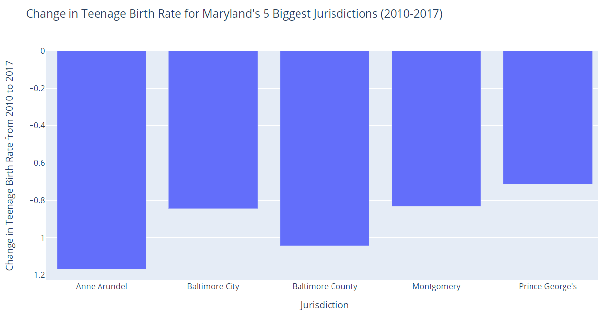
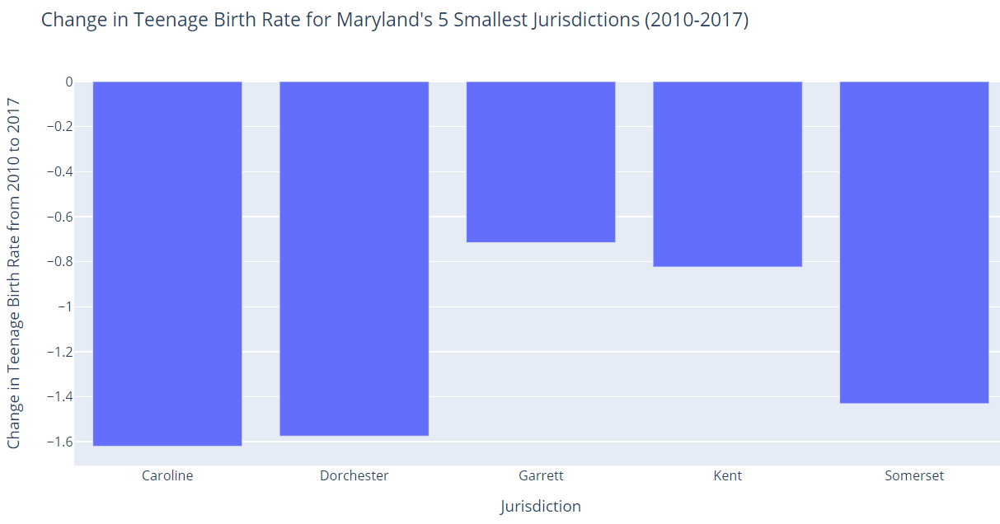
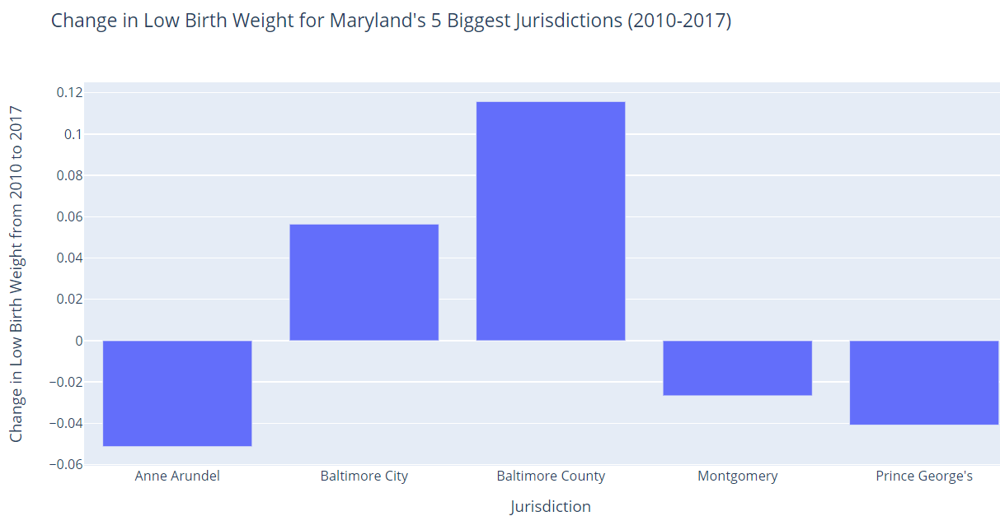
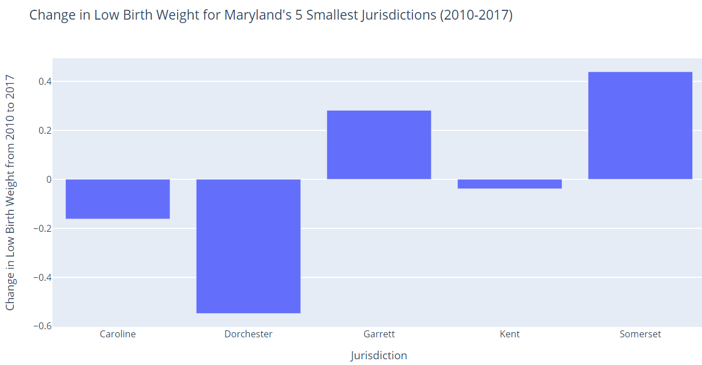
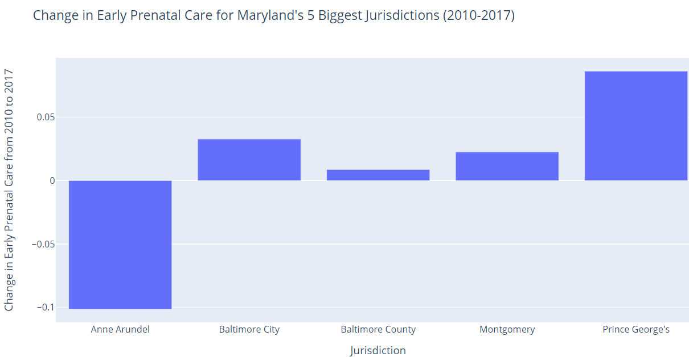
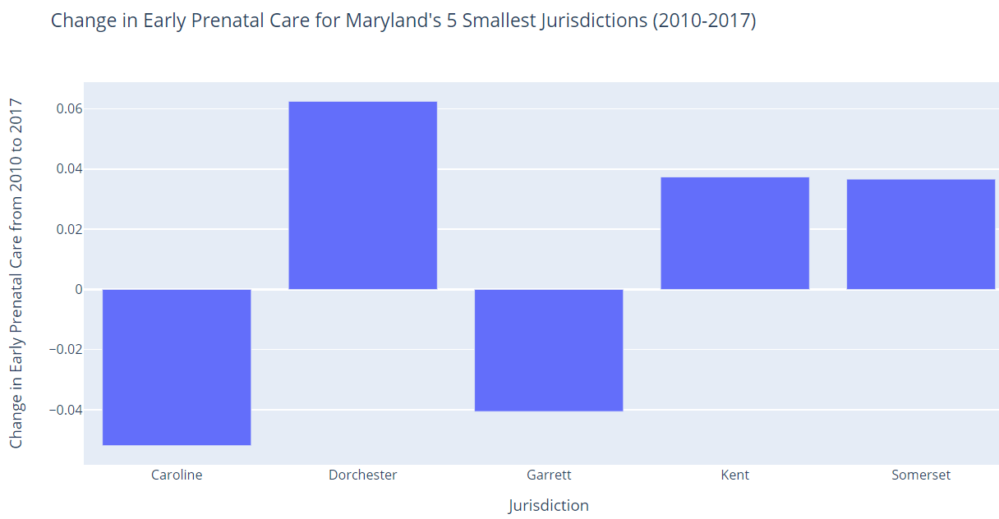

# Analyzing Percent Change in Teenage Birth Rate, Low Birth Weight, and Early Prenatal in Maryland from 2010-2017 

## Google Colaboratory Link 
[Python/Google Colaboratory](https://colab.research.google.com/drive/1QUmTvWJn7qQ4KBY9saS84pE6xG56tdcX?usp=sharing)

## Background
According to [March of Dimes](https://www.marchofdimes.org/Peristats/ViewTopic.aspx?reg=24&top=1&lev=0&slev=4), in an average week in Maryland, 1,406 babies are born, 139 babies are born preterm, 120 babies are born at a low birth weight, and nine babies die before the age of one. In 2018, the low birth weight rate of Maryland was [8.8%](https://www.marchofdimes.org/Peristats/ViewTopic.aspx?reg=24&top=4&lev=0&slev=4), which did not reach the Healthy People 2020 goal of a rate of 7.8% or lower. According to the same source, black babies were about two times as likely as white babies to be born at a low birth weight from 2016 to 2018, on average. In 2018, in Maryland, [74.6%](https://www.marchofdimes.org/peristats/ViewTopic.aspx?reg=24&top=5&lev=0&slev=4) of live births were to women receiving early prenatal care, 18.8% were to women starting prenatal care in their second trimester, and 6.6% were to women who received late or no prenatal care at all. About one in six infants was born to a mother receiving inadequate prenatal care in Maryland at the time. 

It is [known](https://www.ncbi.nlm.nih.gov/books/NBK219236/) that teenage pregnancy is linked to many adverse outcomes for both the mother and child, including low birth weight, health problems from poor perinatal outcomes, increased risk of perinatal death, and poor academic achievement in the child. Babies born with low birth weight have a [higher risk](https://www.marchofdimes.org/complications/low-birthweight.aspx.) of heart disease, diabetes, high blood presusure, intellectual and developmental disabilities, obesity and metabolic syndrome. [Research](https://www.womenshealth.gov/a-z-topics/prenatal-care) has also shown that access to prenatal care is very important for a healthy pregnancy, and the babies of mothers who do not have access to prenatal care are three times more likely to have low birth weight and five times more likely to die.

## Data Sources
 - Data from the [Maryland Open Data Portal](https://opendata.maryland.gov/) to examine teen birth rate, low birth weight, and early prenatal care variables
   - Health data from the SHIP program-- which falls under Human and Health Services-- because it was fairly consistent across variables
      - SHIP is the State Health Improvement Process
   - Sources
      - [SHIP Teen Birth Rate from 2010-2017](https://opendata.maryland.gov/Health-and-Human-Services/SHIP-Teen-Birth-Rate-2010-2017/t8wg-hb7j)
      - [SHIP SHIP Early Prenatal Care 2010-2017](https://opendata.maryland.gov/Health-and-Human-Services/SHIP-Early-Prenatal-Care-2010-2017/48en-6hyz)
      - [SHIP Babies with Low Birth Weight 2010-2017](https://opendata.maryland.gov/Health-and-Human-Services/SHIP-Babies-with-Low-Birth-Weight-2010-2017/cyet-5jd3)

## Data Analysis Method
Percent Change in the three selected variables: [Python/Google Colaboratory](https://colab.research.google.com/drive/1QUmTvWJn7qQ4KBY9saS84pE6xG56tdcX?usp=sharing) (same link as above)

## Overview of Data Findings 

Several counties within Maryland displayed relatively high teen birth rates, high low birth weight, and low early prenatal care based on the percent change, but emphasis for improvement can be placed to Prince George's, Garrett, and Somerset Counties.

## Data Visualization 

Explanations of these visualizations are included in the GitHub repository for the final project. 

### Teen Birth Rate 
 
 

### Low Birth Weight
 
 

### Early Prenatal Care 
 
 
